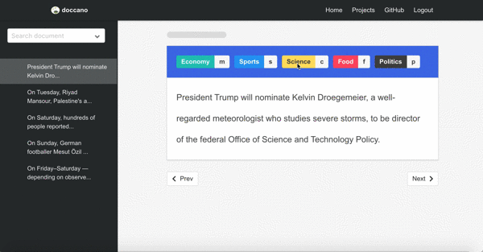

# doccano

doccano is an open source text annotation tool for human. It provides annotation features for text classification, sequence labeling and sequence to sequence. So, you can create labeled data for sentiment analysis, named entity recognition, text summarization and so on. Just create project, upload data and start annotation. You can build dataset in hours.

## Demo

You can enjoy [annotation demo](http://doccano.herokuapp.com).

### Sequence labeling

First demo is one of the sequence labeling tasks, named-entity recognition. You just select text spans and annotate it. Since doccano supports shortcut key, so you can quickly annotate text spans.


### Text classification

Second demo is one of the text classification tasks, topic classification. Since there may be more than one category, you can annotate multi-labels.



### Sequence to sequence

Final demo is one of the sequence to sequence tasks, machine translation. Since there may be more than one responses in sequence to sequence tasks, you can create multi responses.


## Features

* Collaborative annotation
* Language independent
* (future) Auto labeling

## Requirements

* Python 3.6+
* django 2.0.5+
* Google Chrome(highly recommended)

## Installation

To install doccano, simply run:

```bash
$ git clone https://github.com/chakki-works/doccano.git
$ cd doccano
$ pip install -r requirements.txt
```

create superuser.

```bash
$ cd app
$ python manage.py createsuperuser
```

## Usage

First, run web application:

```bash
$ python manage.py runserver
```

Then, open <http://localhost:8080> in your browser.

## Contribution

As with any software doccano is under continuous development. If you have requests for features please file an issue describing your request. Also, if you want to see work towards a specific feature feel free to contribute by working towards it. The standard procedure is to fork the repository, add a feature, fix a bug, then file a pull request that your changes are to be merged into the main repository and included in the next release.

## Contact

For help and feedback please feel free to contact [the author](https://github.com/Hironsan).

**If you are favorite to doccano, please follow my [GitHub](https://github.com/Hironsan) and [Twitter](https://twitter.com/Hironsan13) account.**